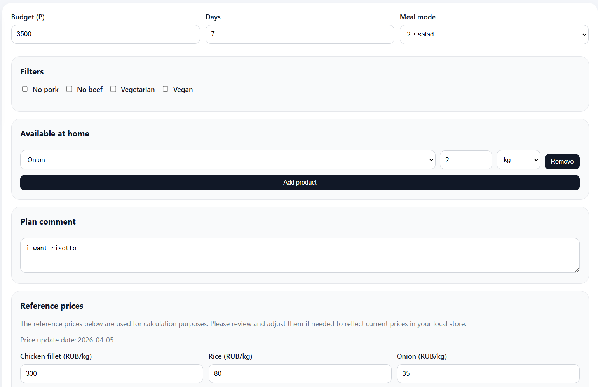
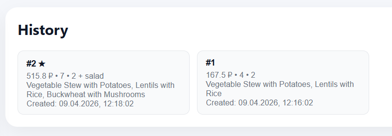
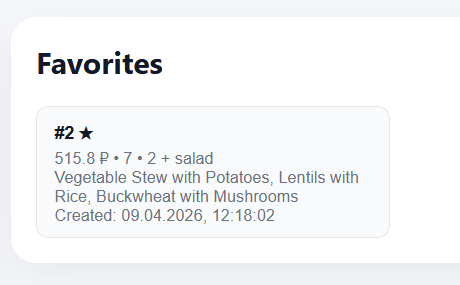
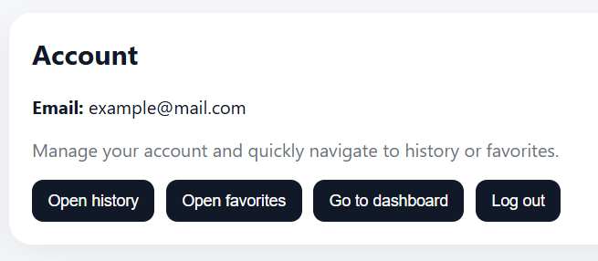

# BudgetBites

BudgetBites is a meal-planning web application for students with limited budgets.

## One-line description
The user enters a budget, pantry items, and dietary preferences, and the system generates a practical multi-day meal plan.

## Demo

### Home

### History

### Favorites

### Account

## Product context

### End-user
Students and other users with a limited food budget.

### Problem
People often do not know what to cook within a budget, what ingredients are missing, and how to plan meals for several days ahead.

### Solution
BudgetBites generates practical batch-cooking meal plans based on budget, pantry items, dietary filters, and user preferences.

## Implemented features
- FastAPI backend
- React frontend
- SQLite database
- Email and password authentication
- Meal plan generation
- Batch cooking plans
- Pantry input
- Missing ingredients list
- Price confirmation and editing
- History
- Favorites
- RU/EN interface
- Dockerized services
- Deployment-ready setup

## Not yet implemented / future work
- More robust LLM fallback handling
- More advanced recipe discovery
- Better account settings
- Extended analytics and personalization

## Usage
1. Register or sign in
2. Enter budget, number of days, meal mode, pantry items, and optional notes
3. Adjust reference prices if necessary
4. Generate a meal plan
5. Save the result to favorites or revisit it in history

## Local development

### Backend
Run locally:
`cd backend && uvicorn app.main:app --reload --host 0.0.0.0 --port 8000`

### Frontend
Run locally:
`cd frontend && npm run dev -- --host 0.0.0.0 --port 5173 --strictPort`

## Docker
Start containers:
`docker compose up --build`

## Deployment

### VM OS
Ubuntu / Debian-based Linux VM

### Required software
- git
- docker
- docker compose plugin

### Deploy steps
1. Clone the repository
2. Copy `backend/.env.example` to `backend/.env`
3. Fill in the required environment variables
4. Set frontend production API base if needed
5. Run `docker compose up -d --build`

## Links
- GitHub repository: https://github.com/pchelikkk/se-toolkit-hackathon
- Deployed product: http://10.93.26.9
